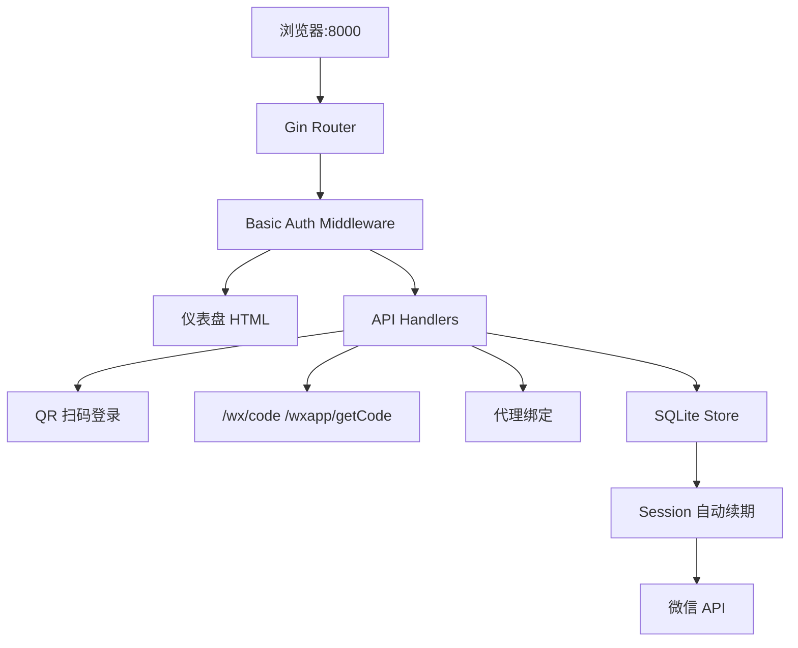

# YYB Go Smallcat Migration

Feature Name: smallcat-migration
Updated: 2026-07-17

## Description

将 YYB Go 从轻量 wx_server 替代升级为对标 smallcat 的完整管理面板。新增控制台鉴权、仪表盘、Docker 一键部署，保留内置 wx_server 和零依赖特性。

## Architecture



**变更点**：
- 新增：Basic Auth 中间件
- 新增：仪表盘 API（/api/dashboard）
- 修改：Dockerfile 支持环境变量
- 不变：QR 扫码、code 获取、代理绑定、session 续期

## Components and Interfaces

### 1. Auth Middleware (`internal/httpapi/auth.go`)

- Basic Auth 中间件，拦截非 /api 路径的页面请求
- 读取环境变量 YYB_USERNAME / YYB_PASSWORD
- 未配置时跳过鉴权（向后兼容）
- 失败计数 + IP 冷却

### 2. Dashboard API (`internal/httpapi/dashboard.go`)

- `GET /api/dashboard` 返回 JSON 格式账号概览
- 统计字段：total, alive, expired, with_proxy
- 账号列表：id, openid, nickname, avatar_url, status, bound_proxy, last_active

### 3. Config 扩展

- 新增 `YYB_USERNAME` / `YYB_PASSWORD` 环境变量
- 可选 `YYB_PORT` 覆盖默认 8000
- CLI 参数优先级高于环境变量

### 4. 前端仪表盘 (`resource/templates/index.html`)

- 顶部统计卡片（总数/在线/离线/代理）
- 账号表格列表
- 实时刷新（10 秒轮询）
- 代理配置内联编辑

## Data Models

无需新增表。现有 `wechat_accounts` 表结构已满足需求：

| 字段 | 用途 |
|------|------|
| id | 主键 |
| openid | 微信 openid |
| nickname | 昵称 |
| avatar_url | 头像本地路径 |
| status | alive/expired/pending |
| bound_proxy | 账号绑定代理 |
| login_buffer | session 数据 |
| last_active | 最后活跃时间 |

## API Endpoints

| 方法 | 路径 | 鉴权 | 说明 |
|------|------|------|------|
| GET | / | Basic Auth | 仪表盘页面 |
| GET | /api/dashboard | 无 | 获取账号概览 JSON |
| POST | /wx/code | 无 | 兼容旧脚本 |
| POST | /wxapp/getCode | 无 | 新版脚本接口 |
| POST | /qr | Basic Auth | 创建扫码二维码 |
| GET | /qr/* | Basic Auth | 轮询扫码状态 |
| PUT | /accounts/proxy | Basic Auth | 设置账号代理 |
| GET | /accounts | Basic Auth | 获取账号列表 |

## Docker Configuration

```bash
# 最简部署（无鉴权）
docker run -d -p 8000:8000 --name yyb-go melon0826/yyb-go

# 带鉴权
docker run -d -p 8000:8000 --name yyb-go \
  -e YYB_USERNAME=admin \
  -e YYB_PASSWORD=123456 \
  -v yyb-data:/app/resource/db \
  melon0826/yyb-go
```

环境变量：

| 变量 | 默认值 | 说明 |
|------|--------|------|
| YYB_USERNAME | (空) | 控制台用户名，空=无鉴权 |
| YYB_PASSWORD | (空) | 控制台密码 |
| YYB_PORT | 8000 | 监听端口 |

## Error Handling

- 鉴权失败：401 + IP 冷却
- 账号 session 过期：标记 expired，仪表盘红色显示
- 微信 API 不可达：/wx/code 返回 502，不崩溃
- 数据库写入失败：返回 500，回滚事务

## Test Strategy

- 单元测试：auth 中间件、dashboard API、环境变量解析
- 集成测试：Docker 镜像启动验证
- 手动测试：青龙脚本对接 QLScriptPublic 签到

## Implementation Order

1. auth 中间件 → 2. dashboard API → 3. 前端仪表盘 → 4. Docker 环境变量 → 5. compose 更新
