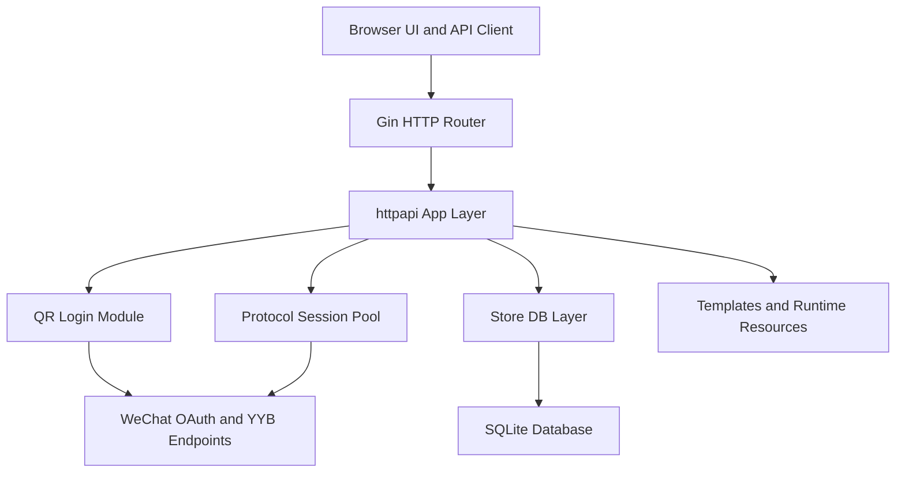
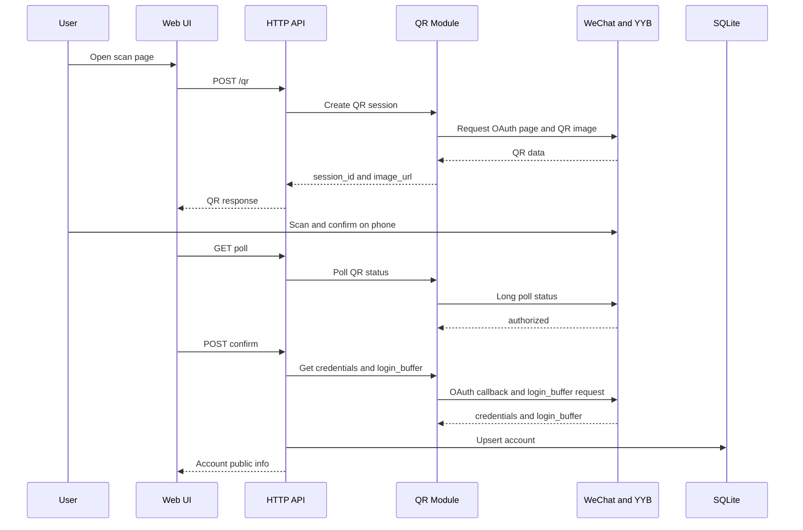
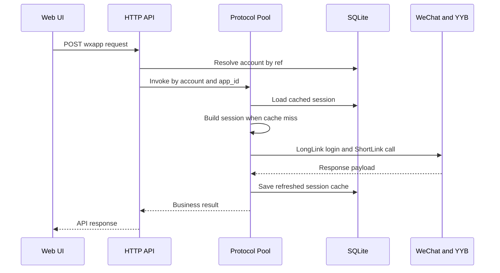

# YYB Go 系统架构

## 1. 架构概览

YYB Go 是一个单体 Go Web 服务，前端页面、HTTP 接口、扫码登录逻辑、协议会话管理和 SQLite 存储都运行在同一个进程中。

整体架构可以分为五层：

1. 页面与接口入口层
2. 应用编排层
3. 登录与协议层
4. 数据存储层
5. 运行时资源层

## 2. 分层结构

## 3. 模块职责

### 3.1 入口层

入口文件：`cmd/yyb-go/main.go`

职责：

- 解析启动参数
- 组装应用配置
- 初始化 `httpapi.App`
- 启动 HTTP 服务
- 管理服务退出

### 3.2 HTTP 与应用编排层

核心目录：`internal/httpapi/`

职责：

- 注册页面和 API 路由
- 处理请求参数和响应封装
- 串联扫码登录、账号管理和 wxapp 调用逻辑
- 输出 OpenAPI 文档和 Swagger 页面

关键文件：

- `app.go`
- `openapi.go`
- `resources.go`
- `dbfile.go`

### 3.3 扫码登录层

核心目录：`internal/qr/`

职责：

- 创建扫码会话
- 拉取二维码图片
- 轮询扫码状态
- 从回调 Cookie 中提取凭据
- 换取 `login_buffer`

这一层负责把“手机扫码授权”转换成“服务端可复用的登录凭据”。

### 3.4 协议会话层

核心目录：`internal/protocol/`

职责：

- 刷新登录凭据
- 构造 `login_buffer` 请求
- 建立 ManualAuth 登录流程
- 维护会话池
- 发起长链路和短链路调用
- 支持 TCP 代理出口

这是系统里最关键的一层，也是与上游协议耦合最深的一层。

### 3.5 数据存储层

核心目录：`internal/store/`

职责：

- 打开和初始化 SQLite
- 维护账号表、会话表、能力表
- 提供账号查询、会话读写、状态更新能力

### 3.6 运行时资源层

核心目录：`resource/`

职责：

- 保存模板文件
- 保存数据库文件
- 保存下载的头像
- 保存临时二维码图片

## 4. 核心数据对象

### 4.1 账号对象

来源：`wechat_accounts`

关键字段：

- `openid`
- `uin`
- `nickname`
- `avatar`
- `user_info`
- `login_buffer`
- `credentials`
- `status`

### 4.2 会话对象

来源：`sessions`

关键字段：

- `wechat_account_id`
- `tcp_proxy`
- `session_blob`
- `expires_at`

这里的 `session_blob` 实际保存的是协议会话序列化结果，包括：

- 发送密钥
- 接收密钥
- UIN
- Ticket
- DeviceID
- HostAppID
- PSK 信息
- ShortLink 目标列表
- 代理信息

### 4.3 能力对象

来源：`features`

默认能力：

- `getCode`
- `getPhoneNumber`
- `operateWxData`

## 5. 主流程架构

### 5.1 扫码接入流程

### 5.2 wxapp 调用流程

## 6. 依赖关系

模块依赖方向如下：

- `cmd/yyb-go` 依赖 `internal/httpapi`
- `internal/httpapi` 依赖 `internal/qr`、`internal/protocol`、`internal/store`
- `internal/qr` 依赖 `internal/protocol`
- `internal/protocol` 依赖 `internal/store`
- `internal/store` 独立负责数据库

这个结构总体上是自顶向下的单体依赖结构，入口清晰，适合逐步增强。

## 7. 代理与网络出口位置

网络出口控制主要发生在协议层。

关键点：

- `main.go` 支持 `--tcp-proxy`
- `protocol/transport.go` 负责直连、SOCKS5、HTTP CONNECT
- `protocol/pool.go` 把 `tcp_proxy` 纳入会话缓存维度

这说明当前架构已经允许：

- 同一账号在不同代理配置下建立不同会话
- 后续扩展为账号级代理策略

## 8. 当前架构特点

当前架构的优点：

- 单体部署简单
- 调试路径短
- 前后端耦合成本低
- 会话缓存逻辑集中
- 扩展账号级代理比较自然

当前架构的限制：

- 安全边界偏弱
- 接口与页面共享同一权限面
- 协议层复杂度高，测试成本高
- 缺少审计与权限模型

## 9. 推荐演进方向

在不推翻当前结构的前提下，推荐这样演进：

1. 在 `httpapi` 层增加鉴权与来源 IP 校验。
2. 在 `store` 层给账号增加网络策略字段。
3. 在 `protocol` 层接入账号级有效代理解析逻辑。
4. 在前端页面增加账号策略管理入口。
5. 在数据库中增加审计日志与调用历史表。

这条演进路径和当前代码结构兼容性最好。
